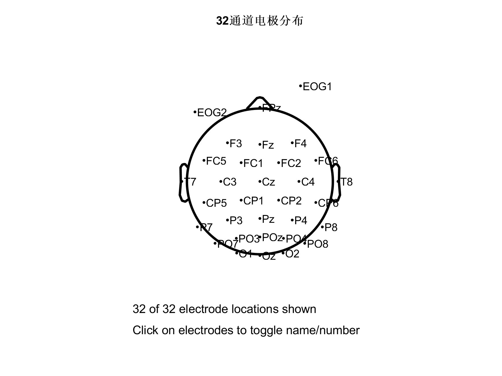
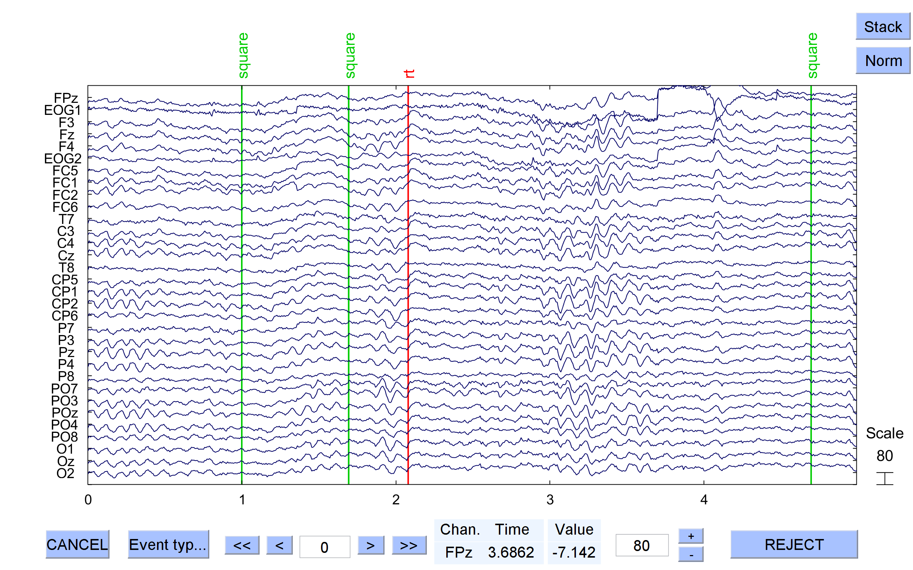
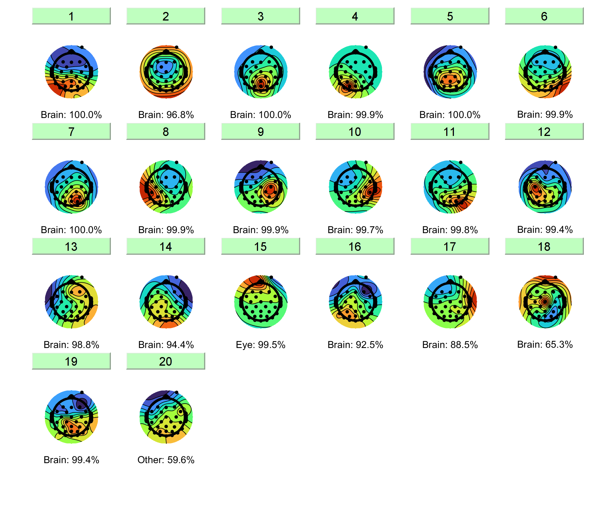
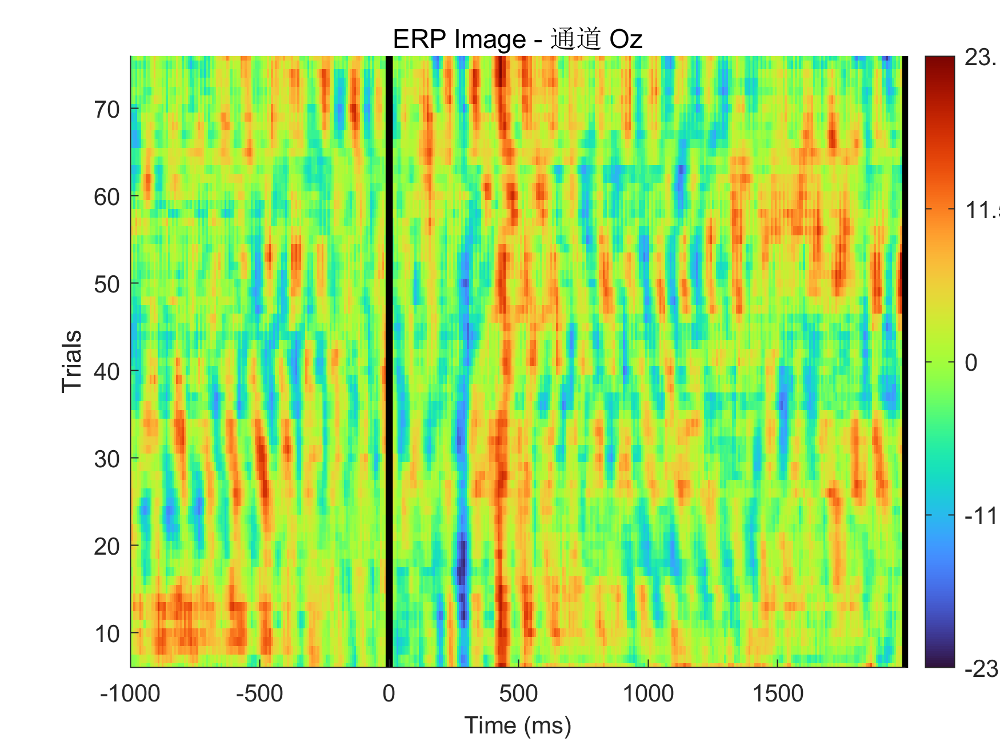
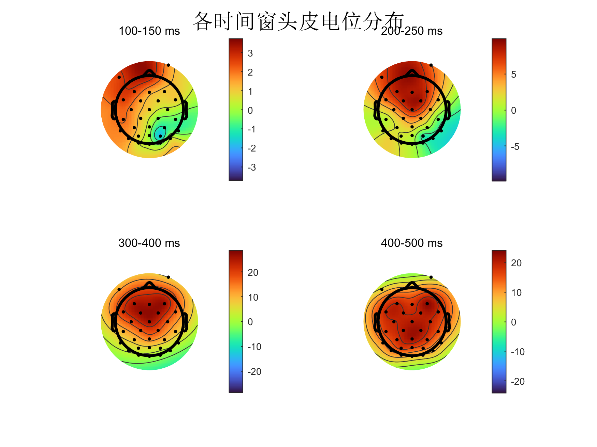
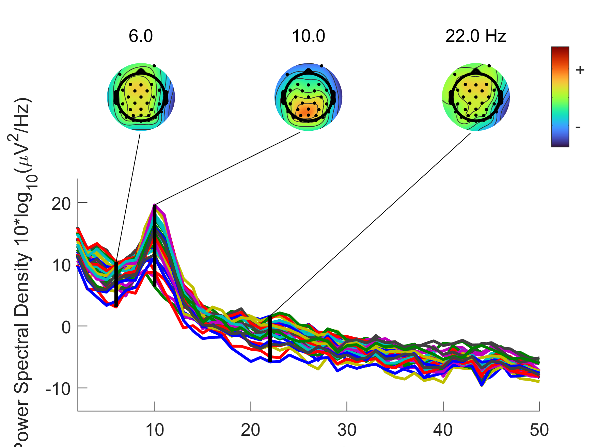
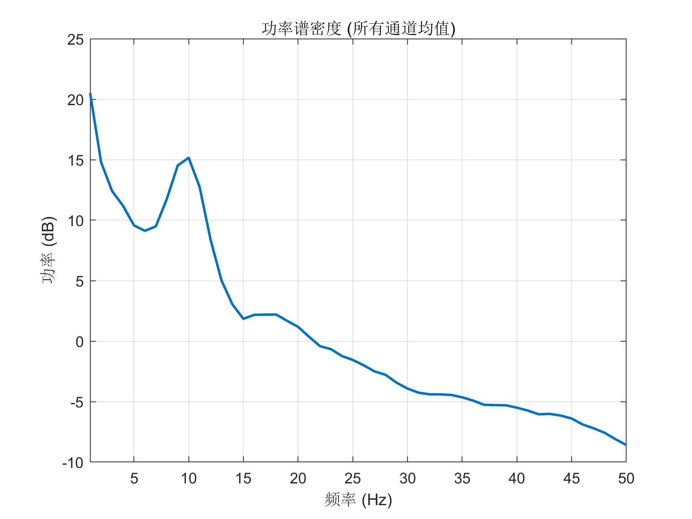

# EEGLAB × MATLAB 实战实验报告
## ——基于 EEGLAB 内置数据集的 EEG 完整处理流程

> **作者：** 乔钰成  
> **日期：** 2025年  
> **机构：** 华东师范大学 · NEOschool  
> **环境：** MATLAB R2024b · EEGLAB 2026.0.0  
> **仓库：** [junmoxiao-cloud/2026BMI-](https://github.com/junmoxiao-cloud/2026BMI-)

---

## 目录

1. [实验背景与目标](#1-实验背景与目标)  
2. [实验环境配置](#2-实验环境配置)  
3. [数据集说明](#3-数据集说明)  
4. [Step 1 · 数据加载与初始可视化](#4-step-1--数据加载与初始可视化)  
5. [Step 2 · 预处理流程](#5-step-2--预处理流程)  
6. [Step 3 · ICA 独立成分分析](#6-step-3--ica-独立成分分析)  
7. [Step 4 · Epoch 提取与 ERP 分析](#7-step-4--epoch-提取与-erp-分析)  
8. [Step 5 · 频谱分析](#8-step-5--频谱分析)  
9. [脚本文件索引](#9-脚本文件索引)  
10. [实验总结与反思](#10-实验总结与反思)  

---

## 1. 实验背景与目标

脑电图（EEG, Electroencephalogram）是记录大脑神经电活动的非侵入式技术，在脑机接口（BCI）、认知神经科学和临床神经病学中广泛应用。本实验以 EEGLAB 官方内置数据集为载体，系统性地走通 EEG 数据从原始采集到特征提取的完整自动化处理流程，为后续脑机接口与认知功能研究（MCI/SCD EEG 微状态分析）建立技术基础。

**实验目标：**

- 掌握 MATLAB + EEGLAB 的基本操作逻辑与脚本化方式
- 理解 EEG 预处理的标准管线（滤波 → 重参考 → 坏导 → ICA）
- 实现 ERP、头皮地形图、功率谱的可视化与导出
- 建立可复现的自动化分析脚本体系

---

## 2. 实验环境配置

| 项目 | 详情 |
|---|---|
| 操作系统 | Windows 11 |
| MATLAB 版本 | R2024b |
| EEGLAB 版本 | 2026.0.0 |
| EEGLAB 路径 | `<你的本机路径>` |
| 网络环境 | 常规 |

### 已安装插件

| 插件 | 版本 | 作用 |
|---|---|---|
| `clean_rawdata` | 2.11 | 自动坏导检测与去除 |
| `firfilt` | 2.8 | FIR 零相位滤波器 |
| `ICLabel` | 1.7 | ICA 成分自动分类（脑/眼/肌/心） |
| `ERPLAB` | 12.20 | ERP 高级分析工具 |
| `dipfit` | 5.6 | 偶极子溯源定位 |
| `EEG-BIDS` | 10.5 | BIDS 格式数据导入 |

> **踩坑记录：** Manage Extensions 联网失败（Java URLConnection 在香港代理下 TLS 握手失败），切换德国代理后解决。

---

## 3. 数据集说明

使用 EEGLAB 官方内置示例数据集（无需额外下载）：

| 属性 | 值 |
|---|---|
| 文件 | `eeglab_data.set` + `eeglab_data.fdt` |
| 路径 | `sample_data/` |
| 实验范式 | 视觉 Oddball（方形/圆形刺激） |
| 采样率 | 128 Hz |
| 通道数 | 32 个（标准10-20系统） |
| 事件类型 | `square`（目标刺激）、`rt`（反应时） |
| 数据形态 | 连续 EEG（Continuous）+ 预分好的 Epoch 版本 |

**EEG 数据结构（MATLAB 中）：**

```matlab
EEG.data      % [32通道 × 时间点] 矩阵，单位 μV
EEG.srate     % 采样率：128 Hz
EEG.chanlocs  % 通道位置结构体（含极坐标信息）
EEG.event     % 事件标注（type / latency / duration）
EEG.times     % 时间轴向量（ms）
```

---

## 4. Step 1 · 数据加载与初始可视化

### 4.1 环境初始化与数据加载

```matlab
eeglab_path = 'D:\Matalb_working_path\eeglab_current\eeglab2026.0.0';
addpath(eeglab_path);
eeglab;

data_path = fullfile(eeglab_path, 'sample_data');
EEG = pop_loadset('filename', 'eeglab_data.set', 'filepath', data_path);
eeglab redraw;
```

### 4.2 通道位置分布

32 个电极按标准 10-20 系统分布于头皮，可视化如下：

<div align="center">
  
  <p><em>图1：32通道头皮电极分布（标准10-20系统）</em></p>
</div>

### 4.3 原始 EEG 波形浏览

```matlab
pop_eegplot(EEG, 1, 1, 1);
```

<div align="center">
  
  <p><em>图2：原始连续 EEG 滚动波形（32通道，含事件标注）</em></p>
</div>

> 可明显观察到眼电（EOG）伪迹：额叶 Fp1/Fp2 通道出现大幅低频偏转，需通过 ICA 去除。

---

## 5. Step 2 · 预处理流程

EEG 预处理是保证后续分析有效性的关键环节，必须严格按照以下顺序执行：

```
原始数据 → 带通滤波 → 平均重参考 → 坏导检测 → 保存
```

### 5.1 带通滤波（1–40 Hz）

```matlab
EEG = pop_eegfiltnew(EEG, 'locutoff', 1, 'hicutoff', 40);
```

- **高通 1 Hz**：去除基线漂移（呼吸、皮肤电导缓慢变化）
- **低通 40 Hz**：去除肌电噪声和工频干扰（50/60 Hz）
- 使用 `pop_eegfiltnew`（零相位 FIR）而非 `pop_eegfilt`，避免相位延迟

### 5.2 平均重参考

```matlab
EEG = pop_reref(EEG, []);   % [] 表示平均参考
```

将所有通道均值设为参考零点，消除单一参考电极引入的偏差。

### 5.3 自动坏导检测

```matlab
EEG = clean_artifacts(EEG, ...
    'FlatlineCriterion', 5, ...    % 持续5秒无变化 → 坏导
    'ChannelCriterion',  0.85, ... % 与邻近通道相关系数<0.85 → 坏导
    'LineNoiseCriterion', 4, ...
    'Highpass', 'off', ...
    'BurstCriterion', 20, ...
    'WindowCriterion', 0.25, ...
    'BurstRejection', 'on');
```

---

## 6. Step 3 · ICA 独立成分分析

ICA（Independent Component Analysis）是 EEG 去伪迹的黄金标准，将混合信号分解为统计独立的子成分，从而分离眼电、肌电、心电等非脑源信号。

### 6.1 运行 ICA

```matlab
EEG = pop_runica(EEG, 'icatype', 'runica', 'extended', 1, 'interrupt', 'on');
```

> ⏱ 耗时约 1–5 分钟，正常现象。

### 6.2 ICLabel 自动分类

```matlab
EEG = pop_iclabel(EEG, 'default');
```

<div align="center">
  
  <p><em>图3：独立成分属性视图（ICLabel 分类结果）——包含头皮地形图、时域波形、功率谱及偶极子位置</em></p>
</div>

**ICLabel 分类标准：**

| 成分类型 | 头皮分布特征 | 频谱特征 | 处置 |
|---|---|---|---|
| 🧠 Brain | 局灶性偶极样分布 | 1/f 衰减，有 Alpha 峰 | **保留** |
| 👁️ Eye | 额极双侧对称大激活 | 低频能量集中（< 5 Hz） | **去除** |
| 💪 Muscle | 颞/枕周边弥散 | 高频（> 20 Hz）能量强 | **去除** |
| ❤️ Heart | 顶叶周期性 | 心率谐波（~1 Hz及倍频） | 去除 |

### 6.3 自动标记并去除非脑源成分

```matlab
% Eye/Muscle 概率 > 80% 则标记去除
EEG = pop_icflag(EEG, [NaN NaN; 0.8 1; 0.8 1; NaN NaN; NaN NaN; NaN NaN; NaN NaN]);
removed_ICs = find(EEG.reject.gcompreject);
EEG = pop_subcomp(EEG, removed_ICs, 0);
fprintf('已去除 %d 个非脑源成分\n', length(removed_ICs));
```

---

## 7. Step 4 · Epoch 提取与 ERP 分析

### 7.1 Epoch 提取与基线校正

```matlab
% 以 'square' 事件为锁时点，提取 -1000 ~ 2000 ms
EEG_epoch = pop_epoch(EEG, {'square'}, [-1 2], 'epochinfo', 'yes');

% 基线校正：减去刺激前 200 ms 均值
EEG_epoch = pop_rmbase(EEG_epoch, [-200 0]);
```

### 7.2 ERP 图像（ERPImage）

ERPImage 将每个 Epoch 的单次响应按行排列，直观展示跨 trial 的响应一致性：

<div align="center">
  
  <p><em>图4：ERP Image——每行为一个 Epoch，颜色表示电压幅值，底部折线为 ERP 均值曲线</em></p>
</div>

### 7.3 头皮地形图（Topoplot）

对 4 个关键时间窗绘制头皮电位空间分布：

```matlab
time_windows = [100 150; 200 250; 300 400; 400 500]; % ms
```

<div align="center">
  
  <p><em>图5：各时间窗头皮电位地形图（100–150 ms / 200–250 ms / 300–400 ms / 400–500 ms）</em></p>
</div>

> **解读：** 300–500 ms 时间窗在顶枕叶（Pz/Oz）出现正向电位，符合视觉 P300 成分的经典空间分布。

---

## 8. Step 5 · 频谱分析

### 8.1 功率谱（各通道叠加）

```matlab
pop_spectopo(EEG, 1, [], 'EEG', 'percent', 15, 'freq', [6 10 22], 'freqrange', [2 50]);
```

<div align="center">
  
  <p><em>图6：各通道功率谱叠加显示（2–50 Hz），右侧为对应频率的头皮地形图</em></p>
</div>

### 8.2 功率谱密度（PSD）与频段标注

<div align="center">
  
  <p><em>图7：功率谱密度曲线，各脑电频段色块标注（Delta/Theta/Alpha/Beta/Gamma）</em></p>
</div>

**脑电频段参考：**

| 频段 | 范围 | 神经意义 |
|---|---|---|
| Delta | 1–4 Hz | 深度睡眠、认知负荷 |
| Theta | 4–8 Hz | 工作记忆、情绪处理 |
| **Alpha** | **8–13 Hz** | **闭眼放松、注意抑制（最标志性）** |
| Beta | 13–30 Hz | 主动思考、运动准备 |
| Gamma | 30–50 Hz | 高级认知绑定 |

> 图中 Alpha 峰（~10 Hz）清晰可见，说明数据质量良好，预处理流程有效。

---

## 9. 脚本文件索引

| 文件名 | 路径 | 说明 |
|---|---|---|
| `eeglab_tutorial_complete.m` | `<你的本机脚本路径>` | 完整教程主脚本（含注释） |
| `eeglab_scripts_summary.m` | `<你的本机路径>` | 关键步骤精简版脚本 |
| `eeglab_startup.m` | `<你的本机路径>` | MATLAB 启动初始化脚本 |
| `EEGLAB_MATLAB_使用指南.md` | `<你的本机路径>` | 环境与命令速查指南 |

**运行方式：**

```matlab
% 方式1：命令行
run('<你的本机脚本路径>')

% 方式2：MATLAB编辑器打开 .m 文件后按 F5
```

---

## 10. 实验总结与反思

### 完成成果

- [x] 完整走通 EEGLAB 标准预处理管线（滤波→重参考→坏导→ICA）
- [x] 生成 ERP、ERPImage、Topomap、PSD 共 7 张分析图
- [x] 实现批量 Figure 自动保存脚本
- [x] 建立可复现的自动化 `.m` 脚本体系

### 遇到的问题与解决

| 问题 | 根本原因 | 解决方法 |
|---|---|---|
| Manage Extensions 无法联网 | Java URLConnection 兼容性问题 | 调试网络状况 |
| 命令行输入路径报错 | MATLAB 不支持直接输入路径执行脚本 | 改用 `run()` 或 F5 |
| `saveas` 保存 GUI 报错 | `gcf` 指向 EEGLAB 主窗口而非数据图 | 改用 `print()` 批量保存 |
| `exportgraphics` 报错 | 需要坐标区句柄而非 Figure 句柄 | 改用 `print()` |

### 与研究方向的关联

本实验建立的技术基础可直接迁移至：
- **EEG 微状态分析**（SCD/MCI 认知衰退标志物研究）
- **BCI 运动想象解码**（Imperial College London 合作方向）
- 后续可引入 **MNE-Python** 与本流程互补，实现跨平台分析

---

*本报告对应实验数据与脚本均已存档于本地工作目录，图片资源位于 `assets/eeglab_lab/`。*
