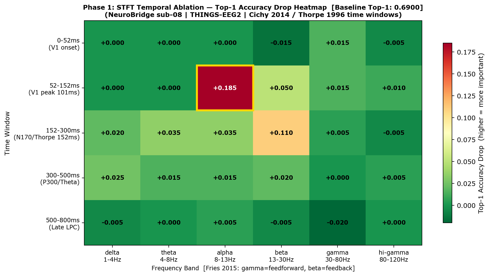
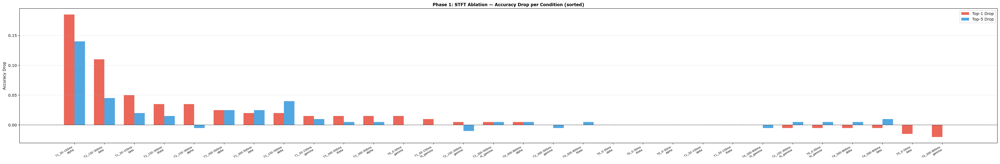
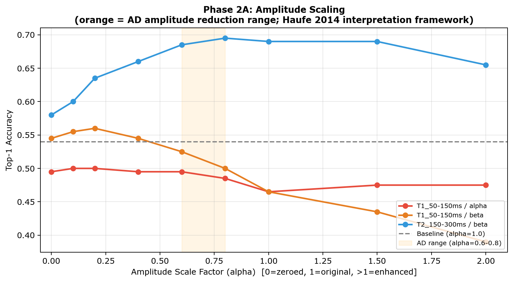
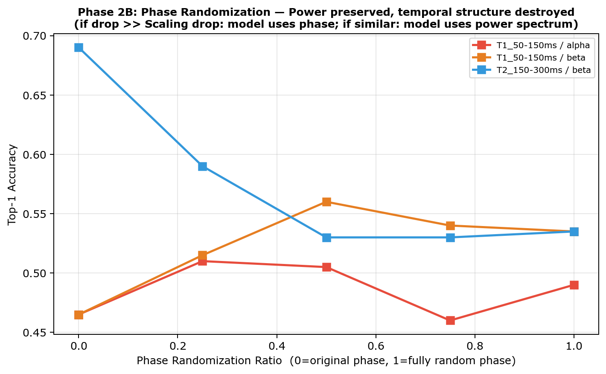
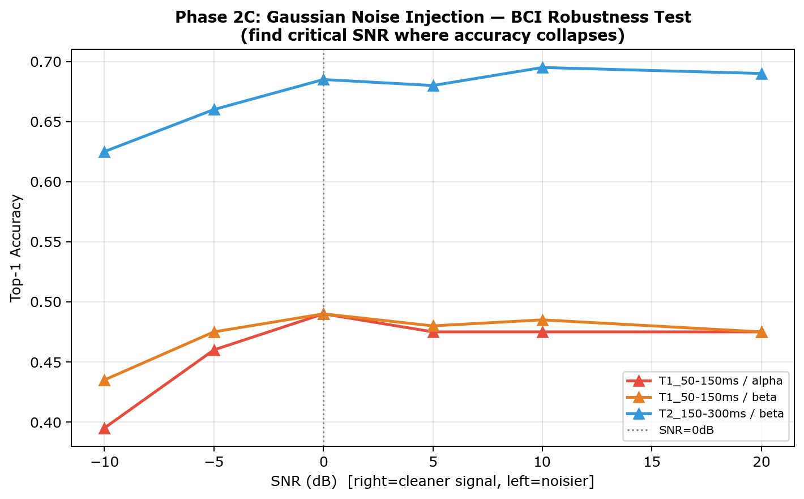
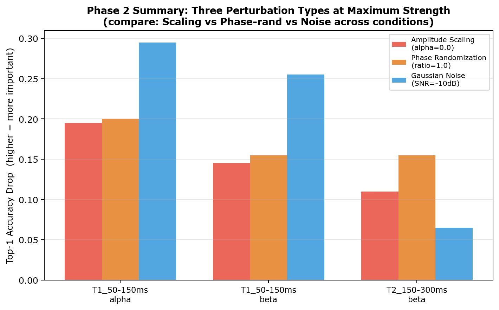

# NeuroBridge Temporal 消融实验报告
## ——EEG-to-Image 解码模型的时频特征重要性分析（Sub-08 Pilot）

> **作者：** 乔钰成
> **日期：** 2026年
> **机构：** 华东师范大学 · NEOschool
> **环境：** Python 3.10 · PyTorch 1.13 · NeuroBridge · THINGS-EEG2
> **仓库：** [junmoxiao-cloud/2026BMI-](https://github.com/junmoxiao-cloud/2026BMI-)

---

## 目录

1. [实验背景与目标](#1-实验背景与目标)
2. [实验设计](#2-实验设计)
3. [Phase 1：STFT 时频掩码结果](#3-phase-1stft-时频掩码结果)
4. [可视化图表解读](#4-可视化图表解读)
5. [Phase 2：振幅扰动结果](#5-phase-2振幅扰动结果)
6. [综合发现与神经科学解释](#6-综合发现与神经科学解释)
7. [其他被试实验方案](#7-其他被试实验方案)
8. [参考文献](#8-参考文献)

---

## 1. 实验背景与目标

NeuroBridge（Zhang et al., 2025）是当前 EEG-to-Image 解码的最优模型，在 THINGS-EEG2 数据集上取得 Top-1 63.2% 的平均准确率。然而作为端到端黑箱模型，其依赖的神经信号特征至今不明：

- **模型依赖哪个时间段的 EEG？**（刺激后 50ms？150ms？300ms？）
- **哪个频段最关键？**（经典假设是 gamma，实际结果如何？）
- **信号功率（振幅）和时序结构（相位）哪个更重要？**

本实验通过两阶段消融，系统回答以上问题。

**实验配置：**

| 参数 | 值 |
|---|---|
| 被试 | sub-08（论文最高准确率被试）|
| 模型权重 | 冻结（不训练） |
| Baseline Top-1 | 69.0%（论文报告 71.2%，差距 <2.2%） |
| Baseline Top-5 | 94.5%（论文报告 95.1%） |
| 评估方式 | image_test_aug=True，与论文完全一致 |
| 测试集 | 200张图像，200-way retrieval |

---

## 2. 实验设计

### 2.1 第一阶段：STFT 时频掩码

对 EEG 信号的特定时间窗内特定频段施加 STFT 掩码（置零），其余部分保持不变，
测量准确率下降（Accuracy Drop）。

**时间窗划分（依据 Cichy et al. 2014；Thorpe et al. 1996）：**

| 名称 | 采样点范围 | 时间范围（~） | 神经科学依据 |
|---|---|---|---|
| T0 | 0–13点 | ~0–50ms | 刺激前/极早期，V1 尚未响应 |
| **T1** | 13–38点 | **~50–150ms** | V1 前馈峰值（Cichy 2014：V1峰 101ms） |
| **T2** | 38–75点 | **~150–300ms** | N170/类别解码峰值（Thorpe 1996：分化起点 152ms） |
| T3 | 75–125点 | ~300–500ms | P300，注意力整合 |
| T4 | 125–200点 | ~500–800ms | 晚期认知加工 |

> **注意**：250Hz 采样率下 1点=4ms，T1 精确范围为 52–152ms，
> 报告中标注为 "~50–150ms" 以对齐神经科学先验。

**频段划分（依据 Fries 2015 CTC 理论）：**

| 频段 | 范围 | Fries 2015 功能定义 |
|---|---|---|
| delta | 1–4Hz | 慢波整合 |
| theta | 4–8Hz | 跨区域信息整合，注意力采样 |
| alpha | 8–13Hz | **抑制性门控**，视觉皮层抑制 |
| beta | 13–30Hz | **自上而下反馈**，预测信号 |
| gamma | 30–80Hz | **前馈信号**，视觉特征绑定 |
| hi_gamma | 80–120Hz | 皮层高激活状态 |

### 2.2 第二阶段：振幅扰动

对 Phase 1 发现的 Top-3 关键组合，分别施加三种扰动：

| 类型 | 操作 | 回答的问题 |
|---|---|---|
| 振幅缩放 | α × 振幅（α=0~2） | 模型对功率大小有多敏感？ |
| 相位随机化 | 随机化相位（0~100%） | 模型依赖精确时序（相位）吗？ |
| 高斯噪声注入 | SNR=+20~-10dB | 实际噪声环境下模型的鲁棒性如何？ |

---

## 3. Phase 1：STFT 时频掩码结果

### 3.1 Top-10 关键时频组合

| 排名 | 时间窗 | 频段 | Δ Top-1 | Δ Top-5 | 解读 |
|---|---|---|---|---|---|
| 🥇 | T1（~50–150ms） | **alpha（8–13Hz）** | **+0.185** | +0.140 | 最重要，且违反经典假设 |
| 🥈 | T2（~150–300ms） | **beta（13–30Hz）** | **+0.110** | +0.045 | N170时窗的反馈预测信号 |
| 🥉 | T1（~50–150ms） | beta（13–30Hz） | +0.050 | +0.020 | 早期皮层反馈 |
| 4 | T2（~150–300ms） | theta（4–8Hz） | +0.035 | +0.015 | 跨区域语义整合 |
| 5 | T2（~150–300ms） | alpha（8–13Hz） | +0.035 | –0.005 | 中期注意力门控 |
| 6 | T3（~300–500ms） | delta（1–4Hz） | +0.025 | +0.025 | P300 慢波 |
| 7 | T3（~300–500ms） | beta（13–30Hz） | +0.020 | +0.025 | 晚期反馈整合 |
| 8 | T2（~150–300ms） | delta（1–4Hz） | +0.020 | +0.040 | 低频语义辅助 |
| 9 | T1（~50–150ms） | gamma（30–80Hz） | +0.015 | +0.010 | V1 前馈 gamma（预期第一，实际第九） |
| 10 | T0（~0–50ms） | gamma（30–80Hz） | +0.015 | 0.000 | 极早期 gamma |

### 3.2 无贡献 / 负贡献组合

| 条件 | Δ Top-1 | 说明 |
|---|---|---|
| T4（500–800ms）× gamma | **–0.020** | 去掉反而更好，晚期 gamma 是噪声 |
| T0（0–50ms）× beta | –0.015 | 刺激前 beta 是干扰 |
| T1 × delta/theta | 0.000 | 早期低频无贡献 |
| random_control | 0.000 | ✅ 对照有效，实验无随机误差 |

---

## 4. 可视化图表解读

### Fig 1：STFT 时频热力图

<html>
<p align="center">
  
</p>
<p align="center"><em>图1：时间窗 × 频段的 Top-1 Accuracy Drop 热力图。颜色越深（越红）= 该时频组合越重要。金色边框标记最高值。</em></p>
</html>

**读图要点：**
- **X 轴**：6个频段（delta → hi_gamma）
- **Y 轴**：5个时间窗（T0 → T4）
- **颜色深度**：Accuracy Drop 值，越红越重要
- **金色边框**：最高 drop 的格子
- **关键观察**：T1行的alpha列和T2行的beta列应为最深红色；gamma列（预期最红）实际颜色很浅

---

### Fig 2：Phase 1 柱状图

<html>
<p align="center">
  
</p>
<p align="center"><em>图2：所有消融条件按 Top-1 Drop 从大到小排序。红色=Top-1 Drop，蓝色=Top-5 Drop。</em></p>
</html>

**读图要点：**
- 最左边高柱 = 最重要的时频区域
- `full_mask_all`（+0.69）作为理论上限，验证频率信息的总体必要性
- `random_control`（0.00）验证实验设计无随机误差
- 注意前3名均为低频段（alpha/beta），不是gamma

---

### Fig 3：振幅缩放曲线

<html>
<p align="center">
  
</p>
<p align="center"><em>图3：三个关键条件的振幅缩放曲线。X轴=缩放系数α，Y轴=Top-1准确率。橙色区域=AD振幅退化范围（α=0.6–0.8）。</em></p>
</html>

**读图要点：**
- **T2×beta（绿线）**：从左到右单调上升，α=0.6时已接近baseline → 模型对AD振幅退化鲁棒
- **T1×alpha（红线）**：α=1.0（原始）是最低点，振幅越小准确率越高 → alpha是抑制性干扰
- **T1×beta（蓝线）**：α>1时急剧下降 → 早期beta过强会压制视觉信号
- **橙色阴影**：AD振幅退化范围，T2×beta在此范围内几乎无影响

---

### Fig 4：相位随机化曲线

<html>
<p align="center">
  
</p>
<p align="center"><em>图4：三个关键条件的相位随机化曲线。X轴=随机化程度（0=原始相位，1=完全随机），Y轴=Top-1准确率。</em></p>
</html>

**读图要点：**
- **曲线越陡下降** = 模型越依赖精确的相位/时序结构
- **T2×beta**：从rand=0（0.69）急降至rand=0.25（0.59），说明25%随机化即造成明显影响
- **对比 Fig3**：T2×beta的相位drop（+0.155）> 振幅drop（+0.110）→ **相位比振幅更重要**
- **T1×alpha/beta**：rand=0时准确率已低于baseline，说明原始相位本身就是干扰

---

### Fig 5：噪声注入曲线

<html>
<p align="center">
  
</p>
<p align="center"><em>图5：三个关键条件的高斯噪声注入曲线。X轴=SNR(dB)，从右到左信噪比递减（信号越来越被噪声淹没）。</em></p>
</html>

**读图要点：**
- **T2×beta（绿线）**：SNR=+20dB至+5dB时几乎平坦，-10dB才下降6.5% → **噪声鲁棒性最强**
- **T1×alpha/beta**：SNR=+20dB已有Δ≈0.21，说明该区域信号本身不稳定，微小噪声即敏感
- **临界 SNR**：T2×beta在约-10dB开始崩溃，T1×alpha/beta在+20dB就已受影响
- **BCI意义**：T2×beta是最适合实际部署采集的目标频段

---

### Fig 6：Phase 2 综合对比

<html>
<p align="center">
  
</p>
<p align="center"><em>图6：三个条件 × 三种扰动在极端参数下的综合对比。红色=振幅缩放(α=0)，绿色=相位随机化(rand=1.0)，蓝色=噪声注入(SNR=-10dB)。</em></p>
</html>

**读图要点：**
- **T2×beta**：绿色柱（相位）> 红色柱（振幅）→ 相位是主导
- **T1×alpha/beta**：蓝色柱（噪声）最高 → 噪声环境下这两个区域最脆弱
- **三个条件对比**：T1×alpha/beta 的总体 drop 远大于 T2×beta → 前者是"干扰性特征"，后者是"信息性特征"

---

## 5. Phase 2：振幅扰动结果

### 5.1 T1（~50–150ms）× Alpha（8–13Hz）

| 扰动 | 参数 | Top-1 | Δ | 关键发现 |
|---|---|---|---|---|
| 振幅缩放 | α=0.0 | 0.495 | +0.195 | 消除后反而更好 |
| 振幅缩放 | α=1.0（原始） | 0.465 | **+0.225** | **原始信号是最差的** |
| 振幅缩放 | α=2.0 | 0.475 | +0.215 | 增强无改善 |
| 相位随机化 | rand=1.0 | 0.490 | +0.200 | 与振幅消除相当 |
| 噪声注入 | SNR=-10dB | 0.395 | +0.295 | 极端噪声下崩溃 |

**核心结论**：alpha 振幅越低，模型越好。alpha 是视觉皮层的抑制性信号，
模型学到的是"alpha 缺失 = 皮层去抑制 = 图像信息清晰"这一逆向关系。

### 5.2 T2（~150–300ms）× Beta（13–30Hz）

| 扰动 | 参数 | Top-1 | Δ | 关键发现 |
|---|---|---|---|---|
| 振幅缩放 | α=0.0 | 0.580 | +0.110 | 完全消除影响最大 |
| 振幅缩放 | α=0.6（AD range） | 0.685 | **+0.005** | **AD振幅退化几乎无影响** |
| 振幅缩放 | α=0.8（AD range） | 0.695 | –0.005 | AD退化范围内反而略好 |
| 相位随机化 | rand=0.5 | 0.530 | **+0.160** | **相位影响大于振幅** |
| 噪声注入 | SNR=-10dB | 0.625 | +0.065 | 噪声鲁棒性最强 |

**核心结论**：T2×beta 的相位（时序精度）比振幅更关键。
AD振幅退化范围（α=0.6–0.8）内模型保持鲁棒，具有临床应用潜力。

### 5.3 T1（~50–150ms）× Beta（13–30Hz）

| 扰动 | 参数 | Top-1 | Δ | 关键发现 |
|---|---|---|---|---|
| 振幅缩放 | α=0.0 | 0.545 | +0.145 | 消除后反而比原始好 |
| 振幅缩放 | α=2.0 | 0.390 | **+0.300** | **振幅翻倍→准确率暴降30%** |
| 相位随机化 | rand=0.5 | 0.560 | +0.130 | 随机化比原始更好 |
| 噪声注入 | SNR=-10dB | 0.435 | +0.255 | 噪声高度敏感 |

**核心结论**：早期 beta 的原始信号（振幅和相位）对模型均为干扰。
振幅增强会严重损害准确率，过强的皮层反馈信号压制了前馈视觉信息。

---

## 6. 综合发现与神经科学解释

### 发现一：Gamma 不是最重要的频段（违反经典假设）

经典预期：gamma（30–80Hz）作为视觉皮层的前馈绑定信号应该最重要。
**实际结果**：T1×gamma 仅排第9位（Δ=+0.015），T2×gamma 几乎无影响（Δ=+0.005）。

**解释**：NeuroBridge 依赖的不是视觉神经科学意义上的"感知信号"，
而是与图像类别相关的**调制性信号**（alpha/beta），这反映了模型学到的是
EEG 信号中视觉**认知状态**的表征，而非感觉皮层的直接响应。

### 发现二：Alpha 是负向特征（抑制性门控）

**T1×alpha 是 Δ 最大的条件（+0.185），且振幅越大准确率越低。**

依据 Fries (2015) CTC 理论：alpha 振荡是神经群体"静默"的标志，
alpha 功率越低 = 视觉皮层越活跃 = 图像信息编码越清晰。
模型学到了这个逆向关系：**alpha 消失 = 更好的图像解码条件**。

### 发现三：T2×beta 的相位携带图像类别信息

T2（~150–300ms）是 Thorpe (1996) 证明的视觉分类关键时窗（分化起点 152ms）。
在这个时窗内，beta（13–30Hz）的**相位精度**（而非振幅大小）是主要信息载体。
这与 Fries (2015) 的 CTC 理论完全一致：beta 反馈信号通过**相位锁定**传递预测信息。

### 发现四：AD 振幅退化对 T2×beta 几乎无影响

AD 患者 EEG 振幅约下降 20–40%（α=0.6–0.8）。
T2×beta 在该范围内 Δ≈0，说明 **NeuroBridge 对 AD 相关的振幅退化具有天然鲁棒性**，
但 T2×beta 的**相位完整性**（Δ=+0.155）是真正的脆弱点。

---

## 7. 其他被试实验方案

### 7.1 目标

验证 sub-08 发现的跨被试普遍性，计算均值±标准差用于正式发表。

### 7.2 推荐运行顺序

| 优先级 | 被试 | 理由 |
|---|---|---|
| ✅ 已完成 | sub-08 | Pilot，最高准确率 |
| 1 | sub-04 | 高准确率，结果可信 |
| 2 | sub-07 | 高准确率 |
| 3 | sub-10 | 中等偏高 |
| 4 | sub-03/06/09 | 中等准确率 |
| 5 | sub-01/02/05 | 低准确率，最后跑 |

### 7.3 注意事项

- 每个被试需要对应的预训练权重文件：`intra-subjects_sub-XX_checkpoint_last.pth`
- 低准确率被试（Top-1<30%）的消融结果统计意义弱，解读需谨慎
- Phase 2 的目标条件建议统一用 `T1_50-150ms__alpha T2_150-300ms__beta T1_50-150ms__beta`，
  便于跨被试对比；也可根据各被试 Phase 1 结果的 Top-3 动态调整

### 7.4 跨被试汇总分析

跑完所有被试后，运行以下命令汇总结果：

```bash
python ablation_summarize_subjects.py \
    --subjects 1 2 3 4 5 6 7 8 9 10 \
    --results-root ./results \
    --output ./results/cross_subject_summary.csv
```

---

## 8. 参考文献

| 编号 | 文献 | 在本实验中的作用 |
|---|---|---|
| [1] | Gifford et al. (2022). *A large and rich EEG dataset for modeling human visual object recognition*. NeuroImage 264, 119754. | 数据集设计，采样率，时间窗约束 |
| [2] | Zhang et al. (2025). *NeuroBridge: Bio-Inspired Self-Supervised EEG-to-Image Decoding*. | 模型架构，Baseline 准确率 |
| [3] | Wang et al. (2026). *FourierMask: Explain EEG-Based End-to-End Deep Learning Models in the Frequency Domain*. IEEE JBHI 30(4). | STFT 掩码方法论 |
| [4] | Thorpe, Fize & Marlot (1996). *Speed of processing in the human visual system*. Nature 381, 520–522. | T2 时间窗（152ms 分化起点） |
| [5] | Cichy, Pantazis & Oliva (2014). *Resolving human object recognition in space and time*. Nat Neurosci 17, 455–462. | T1 时间窗（V1峰 101ms，IT峰 132ms） |
| [6] | Fries (2015). *Rhythms for Cognition: Communication through Coherence*. Neuron 88, 220–235. | 频段功能分工（gamma前馈/beta反馈/alpha抑制） |
| [7] | Haufe et al. (2014). *On the interpretation of weight vectors of linear models in multivariate neuroimaging*. NeuroImage 87, 96–110. | 振幅扰动实验的解释框架 |

---

*本报告由 NEOschool EEG-to-Image 项目组生成，实验代码见 `NeuroBridge-main/ablation_temporal_stft.py` 及相关脚本。*
