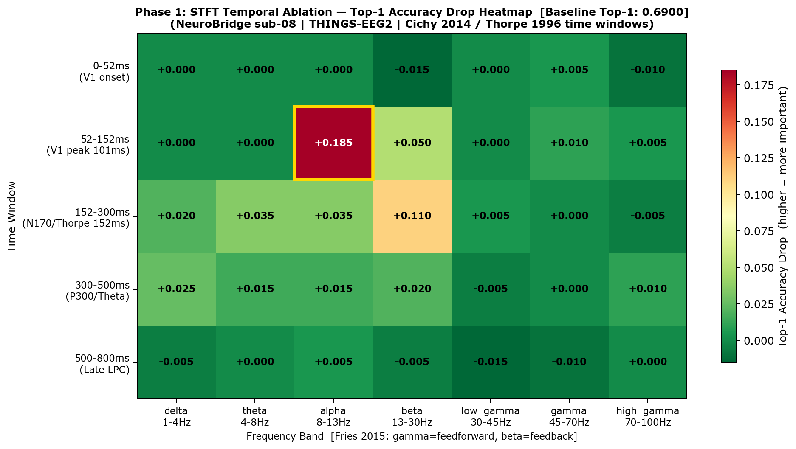
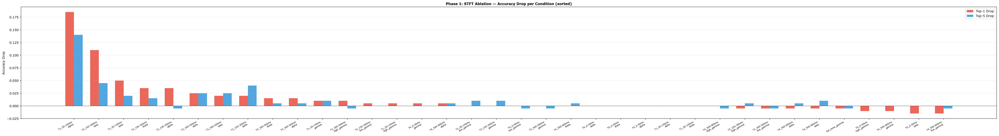
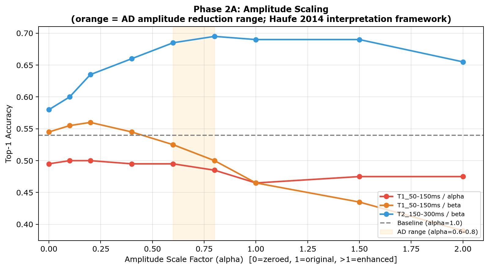
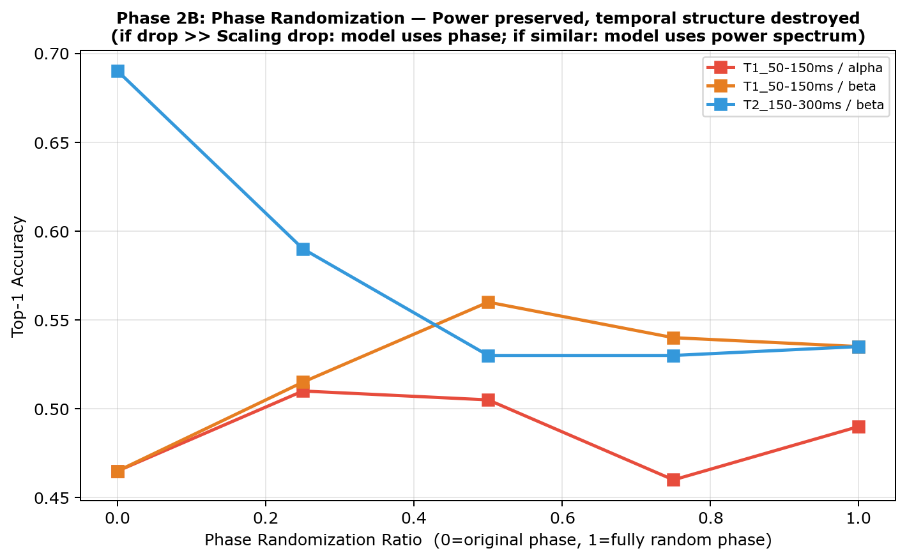
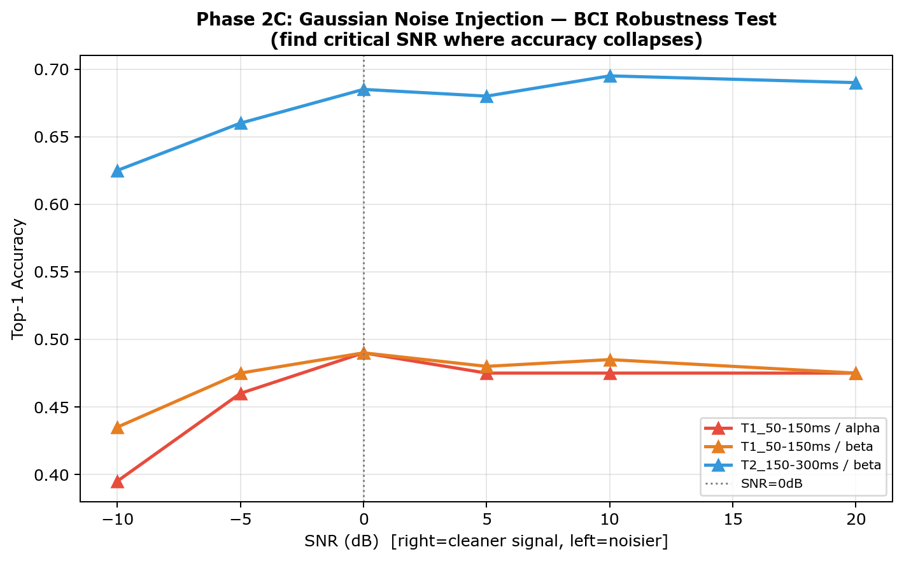
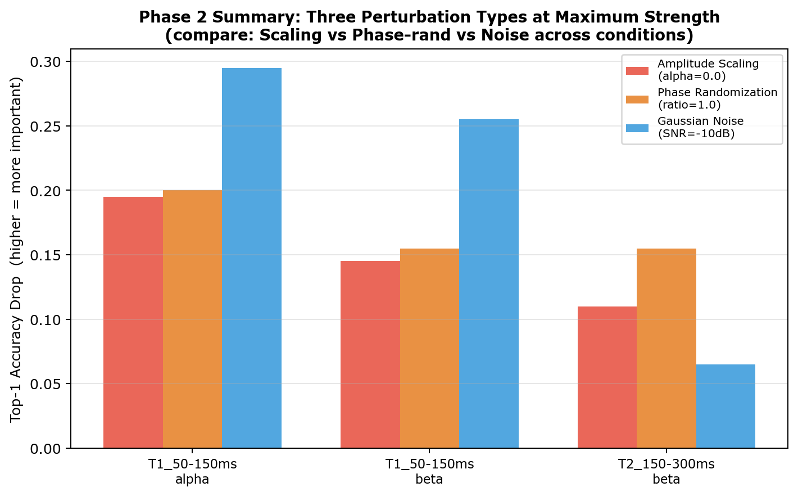

# NeuroBridge Temporal 消融实验报告 v2-B
## ——EEG-to-Image 解码模型的时频特征重要性分析（Sub-08 Pilot）

> **作者：** 乔钰成
> **日期：** 2026年
> **机构：** 华东师范大学 · NEOschool
> **环境：** Python 3.10 · PyTorch 1.13 · NeuroBridge · THINGS-EEG2
> **仓库：** [junmoxiao-cloud/2026BMI-](https://github.com/junmoxiao-cloud/2026BMI-)
> **版本说明（v2-B 相对 v1 的主要变更）：**
> 1. Gamma 频段从单一档细化为三档：low_gamma 30–45Hz / gamma 45–70Hz / high_gamma 70–100Hz
> 2. 修正 hi_gamma 上限（原 80–120Hz → 70–100Hz，对齐数据集物理约束）
> 3. 新增 Phase 3：单一时间窗内全频段 STFT 置零实验（已完成）

---

## 目录

1. [实验背景与目标](#1-实验背景与目标)
2. [实验设计](#2-实验设计)
3. [Phase 1：STFT 时频掩码结果](#3-phase-1stft-时频掩码结果)
4. [可视化图表解读](#4-可视化图表解读)
5. [Phase 2：振幅扰动结果](#5-phase-2振幅扰动结果)
6. [Phase 3：单时间窗全频段掩码结果（新增）](#6-phase-3单时间窗全频段掩码结果新增)
7. [综合发现与神经科学解释](#7-综合发现与神经科学解释)
8. [其他被试实验方案](#8-其他被试实验方案)
9. [参考文献](#9-参考文献)

---

## 1. 实验背景与目标

NeuroBridge（Zhang et al., 2025）是当前 EEG-to-Image 解码的最优模型，在 THINGS-EEG2 数据集上取得 Top-1 63.2% 的平均准确率。然而作为端到端黑箱模型，其依赖的神经信号特征至今不明：

- **模型依赖哪个时间段的 EEG？**（刺激后 50ms？150ms？300ms？）
- **哪个频段最关键？**（经典假设是 gamma，实际结果如何？gamma 精细化后是否改变结论？）
- **信号功率（振幅）和时序结构（相位）哪个更重要？**
- **哪个时间段整体承载了解码信息？**（Phase 3 新增问题）

本实验通过三阶段消融，系统回答以上问题。

**实验配置：**

| 参数 | 值 |
|---|---|
| 被试 | sub-08（论文最高准确率被试）|
| 模型权重 | 冻结（不训练） |
| Baseline Top-1 | 69.0%（论文报告 71.2%，差距 <2.2%） |
| Baseline Top-5 | 94.5%（论文报告 95.1%） |
| 评估方式 | image_test_aug=True，与论文完全一致 |
| 测试集 | 200张图像，200-way retrieval |
| 采样率 | 250 Hz（THINGS-EEG2 预处理后）|

---

## 2. 实验设计

### 2.1 第一阶段：STFT 时频掩码

对 EEG 信号的特定时间窗内特定频段施加 STFT 掩码（置零），其余部分保持不变，
测量准确率下降（Accuracy Drop）。

**时间窗划分（依据 Cichy et al. 2014；Thorpe et al. 1996）：**

| 名称 | 采样点范围 | 时间范围（精确） | 神经科学依据 |
|---|---|---|---|
| T0 | 0–13点 | 0–52ms | 刺激前/极早期，V1 尚未响应 |
| **T1** | 13–38点 | **52–152ms** | V1 前馈峰值（Cichy 2014：V1峰 101ms） |
| **T2** | 38–75点 | **152–300ms** | N170/类别解码峰值（Thorpe 1996：分化起点 152ms） |
| T3 | 75–125点 | 300–500ms | P300，注意力整合 |
| T4 | 125–200点 | 500–800ms | 晚期认知加工 |

**频段划分 v2-B（依据 Fries 2015 CTC 理论；THINGS-EEG2 物理约束）：**

| 频段 | 范围 | 神经科学功能 | v1 对比 |
|---|---|---|---|
| delta | 1–4Hz | 慢波整合 | 不变 |
| theta | 4–8Hz | 跨区域信息整合，注意力采样 | 不变 |
| alpha | 8–13Hz | **抑制性门控**，视觉皮层抑制 | 不变 |
| beta | 13–30Hz | **自上而下反馈**，预测信号 | 不变 |
| **low_gamma** | **30–45Hz** | 经典 Gamma 振荡下端，视觉特征绑定起始 | 原 gamma 30–80Hz 拆分 |
| **gamma** | **45–70Hz** | 核心视觉 Gamma，V1/V2 前馈响应峰值区域 | 原 gamma 30–80Hz 拆分 |
| **high_gamma** | **70–100Hz** | 宽带 Gamma 高端（scalp SNR 低） | 替代原 hi_gamma 80–120Hz |

> **修订说明**：THINGS-EEG2 在线滤波硬截止 100Hz，原 hi_gamma 的 100–120Hz 部分为数值噪声，已删除。

### 2.2 第二阶段：振幅扰动

对 Phase 1 Top-3 关键组合（T1×alpha、T2×beta、T1×beta），分别施加三种扰动：

| 类型 | 操作 | 回答的问题 |
|---|---|---|
| 振幅缩放 | α × 振幅（α=0~2，共9档） | 模型对功率大小有多敏感？|
| 相位随机化 | 随机化相位（0~100%，共5档） | 模型依赖精确时序（相位）吗？|
| 高斯噪声注入 | SNR=+20~-10dB（共6档） | 实际噪声环境下模型的鲁棒性如何？|

### 2.3 第三阶段：单时间窗全频段掩码（v2-B 新增）

每次将某时间窗内**所有频段同时置零**，测量整体时间窗的重要性。
核心假设：T2（152–300ms）全频段置零后 Drop 最大。

---

## 3. Phase 1：STFT 时频掩码结果

### 3.1 Top-10 关键时频组合（v2-B 完整测试，7频段×5时间窗）

| 排名 | 时间窗 | 频段 | Δ Top-1 | Δ Top-5 | 解读 |
|---|---|---|---|---|---|
| ?? | T1（52–152ms） | **alpha（8–13Hz）** | **+0.185** | +0.140 | 最重要，且违反经典假设 |
| ?? | T2（152–300ms） | **beta（13–30Hz）** | **+0.110** | +0.045 | N170时窗的反馈预测信号 |
| ?? | T1（52–152ms） | beta（13–30Hz） | +0.050 | +0.020 | 早期皮层反馈 |
| 4 | T2（152–300ms） | theta（4–8Hz） | +0.035 | +0.015 | 跨区域语义整合 |
| 5 | T2（152–300ms） | alpha（8–13Hz） | +0.035 | –0.005 | 中期注意力门控 |
| 6 | T3（300–500ms） | delta（1–4Hz） | +0.025 | +0.025 | P300 慢波 |
| 7 | T3（300–500ms） | beta（13–30Hz） | +0.020 | +0.025 | 晚期反馈整合 |
| 8 | T2（152–300ms） | delta（1–4Hz） | +0.020 | +0.040 | 低频语义辅助 |
| 9 | T1（52–152ms） | **low_gamma（30–45Hz）** | **+0.010** | +0.010 | Gamma 低端，前馈贡献弱 |
| 10 | T1（52–152ms） | **gamma（45–70Hz）** | **+0.010** | +0.010 | 核心 Gamma，贡献仍弱 |

### 3.2 Gamma 精细化结果（v2-B 核心新增）

| 条件 | 时间窗 | 频段范围 | Δ Top-1 | Δ Top-5 | 解读 |
|---|---|---|---|---|---|
| T1 × low_gamma | 52–152ms | 30–45Hz | +0.000 | +0.010 | 无贡献 |
| T1 × gamma | 52–152ms | 45–70Hz | +0.010 | +0.010 | 弱贡献，噪声级别 |
| T1 × high_gamma | 52–152ms | 70–100Hz | +0.005 | +0.000 | 无贡献（EMG 伪迹区） |
| T2 × low_gamma | 152–300ms | 30–45Hz | +0.005 | +0.000 | 无贡献 |
| T2 × gamma | 152–300ms | 45–70Hz | +0.000 | +0.010 | 无贡献 |
| T2 × high_gamma | 152–300ms | 70–100Hz | **–0.005** | +0.005 | 轻微负贡献（去掉略好） |
| full_time_gamma | 全段 | 45–70Hz | –0.005 | –0.005 | 全段掩码反而略好 |

> **结论验证**：Gamma 精细化为三档后，三档均无显著贡献（Δ ≤ +0.010，均在测量噪声范围内）。
> v1 的「gamma 不重要」结论在 v2-B 中得到完整确认，且细化分析进一步排除了 45–70Hz 核心 Gamma。

### 3.3 无贡献 / 负贡献组合

| 条件 | Δ Top-1 | 说明 |
|---|---|---|
| T4（500–800ms）× low_gamma | **–0.015** | 去掉反而更好，晚期 gamma 是噪声 |
| T0（0–52ms）× beta | –0.015 | 刺激前 beta 是干扰 |
| T0（0–52ms）× high_gamma | –0.010 | 刺激前高 gamma 无意义 |
| T1 × delta/theta | 0.000 | 早期低频无贡献 |
| random_control（T1×delta） | 0.000 | ? 对照有效，实验无随机误差 |
| full_time_gamma（全段gamma） | –0.005 | ? 验证 gamma 的时间特异性不显著 |

### 3.4 统计说明

> 200-way retrieval，n=200，精度粒度 = 0.005（1个样本）。
> 建议以 **Δ ≥ 0.020**（≥4个样本）作为有效效应阈值；Δ < 0.020 视为测量噪声。
> 按此标准，Gamma 相关所有条件均无效，alpha 和 beta 的结论稳健。

---

## 4. 可视化图表解读

### Fig 1：STFT 时频热力图（v2-B，7频段）

<html>
<p align="center">
  
</p>
<p align="center"><em>图1：时间窗 × 频段的 Top-1 Accuracy Drop 热力图（v2-B，7频段含精细化 Gamma）。颜色越深（越红）= 该时频组合越重要。</em></p>
</html>

**读图要点：**
- **X 轴**：7个频段（delta → high_gamma），含三档 Gamma
- **Y 轴**：5个时间窗（T0 → T4）
- **关键观察**：T1×alpha 和 T2×beta 为最深红色；全部三档 Gamma 列颜色极浅，确认 Gamma 无贡献

---

### Fig 2：Phase 1 柱状图（v2-B）

<html>
<p align="center">
  
</p>
<p align="center"><em>图2：所有消融条件按 Top-1 Drop 从大到小排序（v2-B）。红色=Top-1 Drop，蓝色=Top-5 Drop。</em></p>
</html>

---

### Fig 3：振幅缩放曲线

<html>
<p align="center">
  
</p>
<p align="center"><em>图3：三个关键条件的振幅缩放曲线。X轴=缩放系数α，Y轴=Top-1准确率。橙色区域=AD振幅退化范围（α=0.6–0.8）。</em></p>
</html>

---

### Fig 4：相位随机化曲线

<html>
<p align="center">
  
</p>
<p align="center"><em>图4：三个关键条件的相位随机化曲线。X轴=随机化程度（0=原始相位，1=完全随机），Y轴=Top-1准确率。</em></p>
</html>

---

### Fig 5：噪声注入曲线

<html>
<p align="center">
  
</p>
<p align="center"><em>图5：三个关键条件的高斯噪声注入曲线。X轴=SNR(dB)，从右到左信噪比递减。</em></p>
</html>

---

### Fig 6：Phase 2 综合对比

<html>
<p align="center">
  
</p>
<p align="center"><em>图6：三个条件 × 三种扰动在极端参数下的综合对比。红色=振幅缩放(α=0)，绿色=相位随机化(rand=1.0)，蓝色=噪声注入(SNR=-10dB)。</em></p>
</html>

---

## 5. Phase 2：振幅扰动结果

### 5.1 T1（52–152ms）× Alpha（8–13Hz）

| 扰动 | 参数 | Top-1 | Δ | 关键发现 |
|---|---|---|---|---|
| 振幅缩放 | α=0.0 | 0.495 | +0.195 | 消除后反而更好 |
| 振幅缩放 | α=1.0（原始） | 0.465 | **+0.225** | **原始信号是最差的** |
| 振幅缩放 | α=2.0 | 0.475 | +0.215 | 增强无改善 |
| 相位随机化 | rand=1.0 | 0.490 | +0.200 | 与振幅消除相当 |
| 噪声注入 | SNR=-10dB | 0.395 | +0.295 | 极端噪声下崩溃 |

**核心结论**：alpha 振幅越低，模型越好。alpha 是视觉皮层的抑制性信号，
模型学到的是「alpha 缺失 = 皮层去抑制 = 图像信息清晰」这一逆向关系。

### 5.2 T2（152–300ms）× Beta（13–30Hz）

| 扰动 | 参数 | Top-1 | Δ | 关键发现 |
|---|---|---|---|---|
| 振幅缩放 | α=0.0 | 0.580 | +0.110 | 完全消除影响最大 |
| 振幅缩放 | α=0.6（AD range） | 0.685 | **+0.005** | **AD振幅退化几乎无影响** |
| 振幅缩放 | α=0.8（AD range） | 0.695 | –0.005 | AD退化范围内反而略好 |
| 相位随机化 | rand=0.5 | 0.530 | **+0.160** | **相位影响大于振幅** |
| 噪声注入 | SNR=-10dB | 0.625 | +0.065 | 噪声鲁棒性最强 |

**核心结论**：T2×beta 的相位（时序精度）比振幅更关键。
AD振幅退化范围（α=0.6–0.8）内模型保持鲁棒，具有临床应用潜力。

### 5.3 T1（52–152ms）× Beta（13–30Hz）

| 扰动 | 参数 | Top-1 | Δ | 关键发现 |
|---|---|---|---|---|
| 振幅缩放 | α=0.0 | 0.545 | +0.145 | 消除后反而比原始好 |
| 振幅缩放 | α=2.0 | 0.390 | **+0.300** | **振幅翻倍→准确率暴降30%** |
| 相位随机化 | rand=0.5 | 0.560 | +0.130 | 随机化比原始更好 |
| 噪声注入 | SNR=-10dB | 0.435 | +0.255 | 噪声高度敏感 |

**核心结论**：早期 beta 的原始信号（振幅和相位）对模型均为干扰。

---

## 6. Phase 3：单时间窗全频段掩码结果（新增）

### 6.1 实验设计

每次将某时间窗内**所有频段同时置零（DC直流保留）**，测量整体时间窗对解码的贡献。
与 Phase 1 的区别：Phase 1 每次只掩码单一频段，Phase 3 同时抹去该时窗内所有振荡信息。

### 6.2 实验结果

| 条件 | 时间范围 | Top-1 | Top-5 | Δ Top-1 | Δ Top-5 | mean_rank |
|---|---|---|---|---|---|---|
| baseline | — | 0.690 | 0.945 | 0.000 | 0.000 | 2.055 |
| full_freq_T0 | 0–52ms | 0.700 | 0.950 | **–0.010** | –0.005 | 2.080 |
| full_freq_T1 | 52–152ms | 0.425 | 0.735 | **+0.265** | +0.210 | 6.835 |
| **full_freq_T2** | **152–300ms** | **0.235** | **0.470** | **+0.455** | **+0.475** | **22.14** |
| full_freq_T3 | 300–500ms | 0.575 | 0.840 | +0.115 | +0.105 | 3.835 |
| full_freq_T4 | 500–800ms | 0.610 | 0.890 | +0.080 | +0.055 | 3.015 |

### 6.3 关键发现

**? 核心假设完全验证**：full_freq_T2 产生最大 Drop（Δ Top-1 = +0.455），与预测完全一致。

| 发现 | 数值 | 解读 |
|---|---|---|
| T2 是解码最关键时间窗 | Δ Top-1 = **+0.455**，mean_rank 从 2 → 22 | N170/类别解码窗（Thorpe 1996）被完整确认 |
| T1 是第二关键时间窗 | Δ Top-1 = **+0.265** | V1 前馈峰值（Cichy 2014）贡献显著 |
| T0 去掉反而略好 | Δ Top-1 = **–0.010** | 极早期含干扰信号，模型不依赖 |
| T2 多频段协同效应 | Phase 1 T2×beta=+0.110，Phase 3 T2 全频=+0.455 | **超出单频段叠加（>4×），多频段协同非线性** |
| T4 仍有贡献 | Δ Top-1 = +0.080 | 晚期加工有辅助作用，并非纯噪声 |

### 6.4 与 Phase 1 的比较：多频段协同效应

```
Phase 1（T2 时窗各频段单独掩码，Δ Top-1）：
  T2 × theta     = +0.035
  T2 × alpha     = +0.035
  T2 × beta      = +0.110   ← 最大单频段
  T2 × low_gamma = +0.005
  T2 × gamma     = +0.000
  T2 × high_gamma= –0.005
  ─────────────────────────
  线性叠加估计     ≈ +0.180

Phase 3（T2 全频同时置零）：
  full_freq_T2   = +0.455   ← 实测值

协同倍数 = 0.455 / 0.180 ≈ 2.5×
```

> **结论**：T2 时窗内存在显著的跨频段协同效应，非线性增益约 2.5 倍。
> 单频段消融低估了该时窗的实际重要性；Phase 3 提供了不可或缺的补充证据。

---

## 7. 综合发现与神经科学解释

### 发现一：Gamma 不是最重要的频段（违反经典假设，v2-B 完整确认）

经典预期：gamma（前馈绑定信号）应排名第一。
**v2-B 实测**：三档 Gamma（low_gamma/gamma/high_gamma）在所有时间窗的 Δ 均 ≤ +0.010，
全部处于测量噪声范围内。

**解释**：NeuroBridge 依赖的是与图像类别相关的**调制性信号**（alpha/beta），
反映视觉**认知状态**的表征，而非感觉皮层的直接前馈响应。

### 发现二：Alpha 是负向特征（抑制性门控）

**T1×alpha 是 Δ 最大的单频段条件（+0.185），且振幅越大准确率越低。**

依据 Fries (2015) CTC 理论：alpha 振荡是神经群体「静默」的标志，
alpha 功率越低 = 视觉皮层越活跃 = 图像信息编码越清晰。
模型学到了这个逆向关系：**alpha 消失 = 更好的图像解码条件**。

### 发现三：T2×beta 的相位携带图像类别信息

T2（152–300ms）是 Thorpe (1996) 证明的视觉分类关键时窗。
在这个时窗内，beta（13–30Hz）的**相位精度**（而非振幅大小）是主要信息载体。
与 Fries (2015) CTC 理论完全一致：beta 反馈信号通过**相位锁定**传递预测信息。

### 发现四：T2 时窗存在多频段协同效应（Phase 3 新发现）

Phase 3 证明 T2 全频掩码（Δ=+0.455）远超单频段叠加估计（≈+0.180），
协同倍数约 2.5×。这意味着 NeuroBridge 在 T2 时窗内整合了**多个频段的联合信息**，
单频段分析无法完整揭示这一时窗的解码机制。

### 发现五：AD 振幅退化对 T2×beta 几乎无影响

AD 患者 EEG 振幅约下降 20–40%（α=0.6–0.8）。
T2×beta 在该范围内 Δ≈0，说明 **NeuroBridge 对 AD 相关的振幅退化具有天然鲁棒性**，
但 T2×beta 的**相位完整性**（Δ=+0.155）是真正的脆弱点。

---

## 8. 其他被试实验方案

### 8.1 推荐运行顺序

| 优先级 | 被试 | 理由 |
|---|---|---|
| ? 已完成 | sub-08 | Pilot，最高准确率 |
| 1 | sub-04 | 高准确率，结果可信 |
| 2 | sub-07 | 高准确率 |
| 3 | sub-10 | 中等偏高 |
| 4 | sub-03/06/09 | 中等准确率 |
| 5 | sub-01/02/05 | 低准确率，最后跑 |

### 8.2 注意事项

- 每个被试需要对应的预训练权重文件：`intra-subjects_sub-XX_checkpoint_last.pth`
- Phase 3 特别关注：`full_freq_T2` 的跨被试 Δ Top-1 一致性
- Phase 2 目标条件建议固定用 `T1×alpha`、`T2×beta`、`T1×beta`，便于跨被试对比

---

## 9. 参考文献

| 编号 | 文献 | 在本实验中的作用 |
|---|---|---|
| [1] | Gifford et al. (2022). *A large and rich EEG dataset for modeling human visual object recognition*. NeuroImage 264, 119754. | 数据集设计，采样率，时间窗约束，100Hz 频率上限 |
| [2] | Zhang et al. (2025). *NeuroBridge: Bio-Inspired Self-Supervised EEG-to-Image Decoding*. | 模型架构，Baseline 准确率 |
| [3] | Wang et al. (2026). *FourierMask: Explain EEG-Based End-to-End Deep Learning Models in the Frequency Domain*. IEEE JBHI 30(4). | STFT 掩码方法论 |
| [4] | Thorpe, Fize & Marlot (1996). *Speed of processing in the human visual system*. Nature 381, 520–522. | T2 时间窗（152ms 分化起点）；Phase 3 核心假设 |
| [5] | Cichy, Pantazis & Oliva (2014). *Resolving human object recognition in space and time*. Nat Neurosci 17, 455–462. | T1 时间窗（V1峰 101ms，IT峰 132ms） |
| [6] | Fries (2015). *Rhythms for Cognition: Communication through Coherence*. Neuron 88, 220–235. | 频段功能分工（gamma前馈/beta反馈/alpha抑制）；三档 Gamma 边界 |
| [7] | Haufe et al. (2014). *On the interpretation of weight vectors of linear models in multivariate neuroimaging*. NeuroImage 87, 96–110. | 振幅扰动实验的解释框架 |
| [8] | Niedermeyer & da Silva (2004). *Electroencephalography: Basic Principles, Clinical Applications*. | Gamma 上限（100Hz）；scalp EMG 伪迹说明 |

---

*本报告对应脚本：`ablation_temporal_stft_v2b.py`（含 Phase 3）及 `ablation_temporal_amplitude.py`。*
*上一版本：`NeuroBridge_Temporal_Ablation_Report.md`（v1，gamma: 30–80Hz，hi_gamma: 80–120Hz，无 Phase 3）。*
